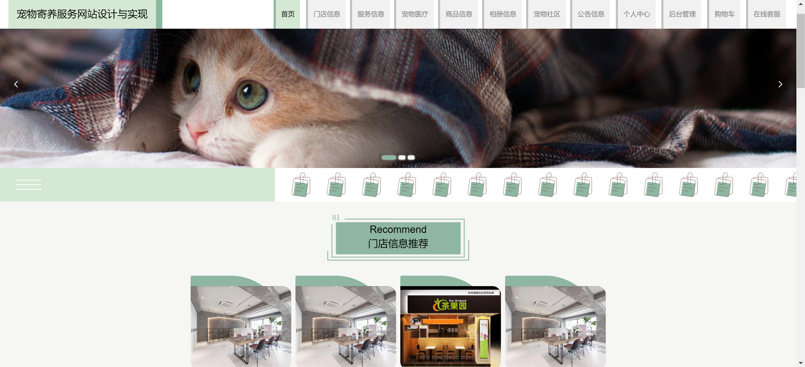
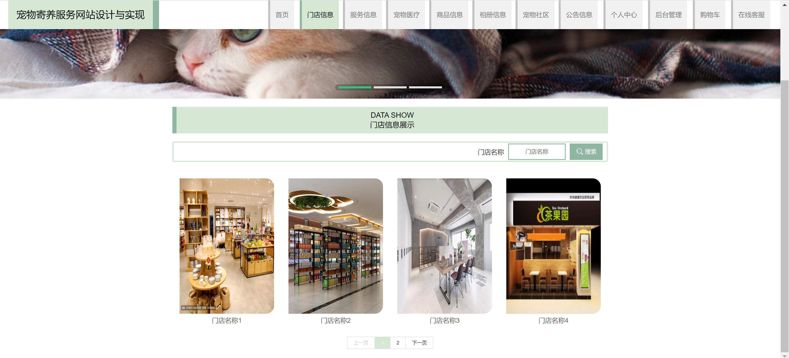
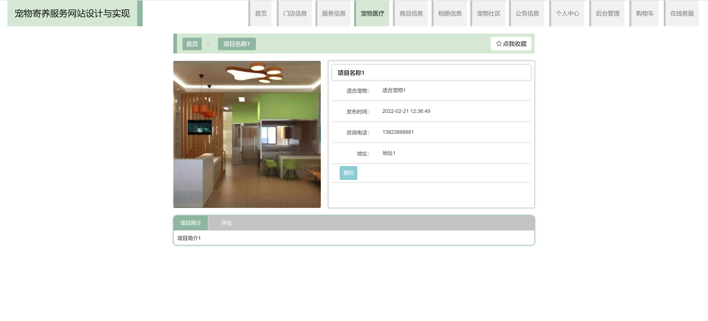
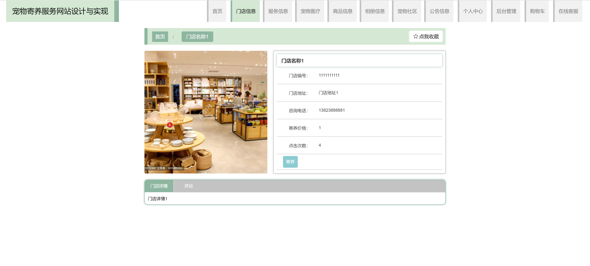
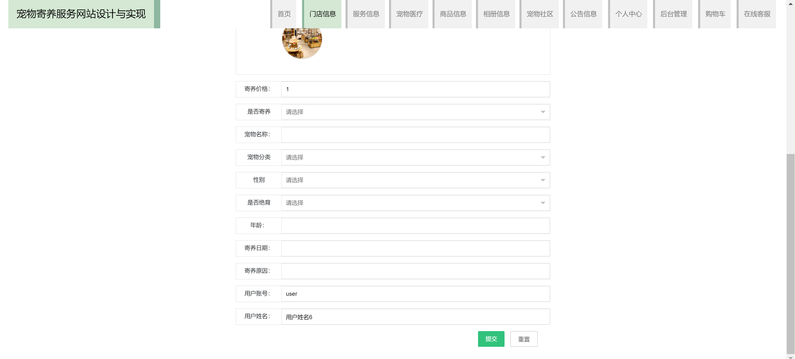
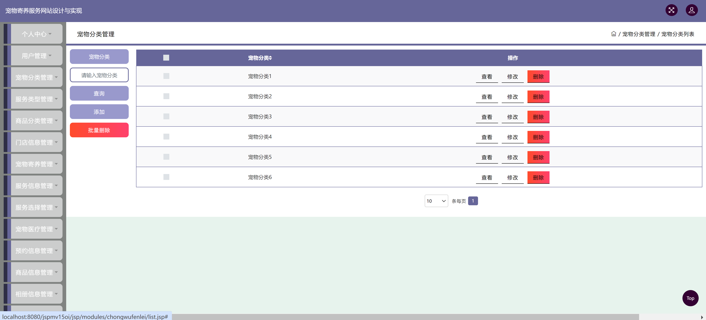
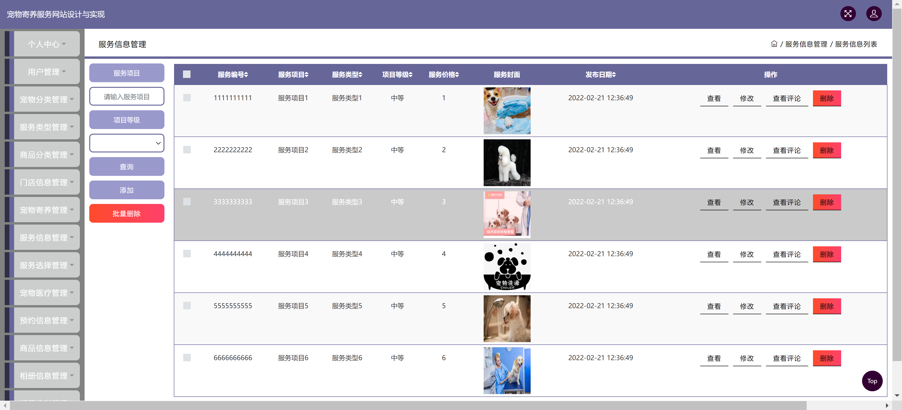
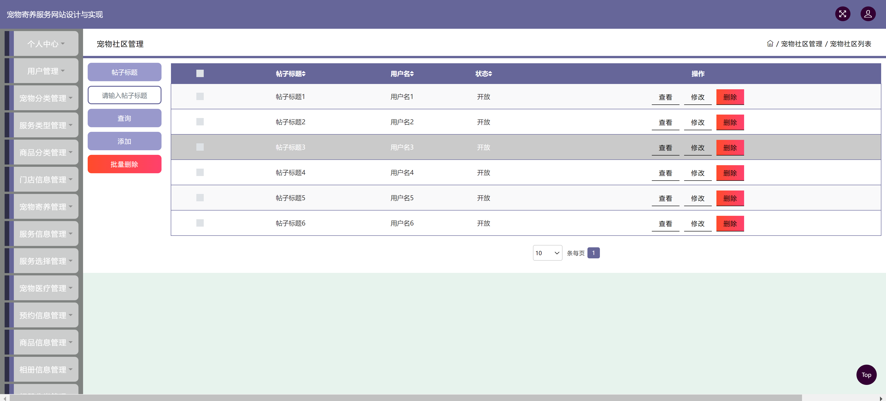
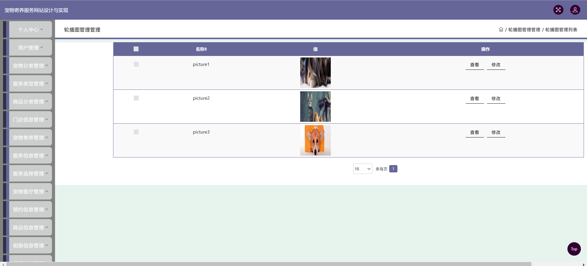

<h1 align="center">宠物寄养管理系统</h1>

## 简介
宠物寄养管理系统：包括管理员、用户角色；功能涵盖用户管理、门店信息管理、宠物分类管理、寄养预约、轮播图管理、订单管理、社区互动等模块，实现全面的寄养服务及信息交流。    --计算机毕业设计源码；毕设源码；java毕业设计源码

## 联系方式

<h3 align="center">获取完整代码与数据库文件 + 微信：deepguan QQ: 86050149 QQ群: 783742310</h3>

<h3 align="center">可帮忙远程部署 包运行成功！提供远程部署、修改代码、设计文档指导、代码讲解等服务！</h3>

## 功能介绍（完整见运行截图）
管理员：管理宠物分类、商品分类、门店信息、宠物寄养信息、轮播图及用户；后台功能包括查看、修改、删除分类、管理宠物社区帖子；整体提升信息管理和更新效率。

用户：首页导航包括门店信息、服务信息、宠物医疗、商品信息，支持项目预约和收藏管理；拥有宠物信息、客户信息和订单管理功能，便于搜索、过滤和修改相关数据。

游客：访问宠物寄养服务网站可以查看门店信息展示、推荐门店、项目信息及其评论；提供注册功能，并通过登录输入用户名和密码访问更多网站服务及个人中心内容。

## 运行截图

本代码来源于网络,仅供学习参考使用!

